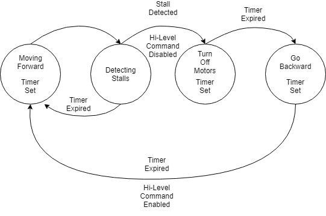

# Indoor Autonomous Navigation System Low Level

## Repository Hierarchy

The Indoor Autonmous System Software is contained within three repositories.

1. [indoor-autonomous-system-cloud](https://github.com/thedch/indoor-autonomous-system-cloud)
1. [indoor-autonomous-system-highlevel](https://github.com/thedch/indoor-autonomous-system-highlevel)
1. [indoor-autonomous-system-lowlevel](https://github.com/thedch/indoor-autonomous-system-lowlevel)

The cloud repository contains code to run the front facing Flask server on GCE. This presents the user with a control panel containing destinations inside the floor plan, and a kill switch.

The high level repository contains ROS code that runs on a Raspberry Pi. This deals with the ROS navigation stack, manual control of the robot, interfacing with the LiDAR, the cloud server, and the low level micro.

The low level repository contains C++ code that interfaces directly with the sensors and motors to control the direction of the robot and read wheel odometry and IMU data. This data is then passed back to the Raspberry Pi where it is processed by ROS.

## Setup

In order to connect the Pi to the Teensy, run the following command:

```
rosrun rosserial_python serial_node.py /dev/ttyACM[#]
```

Where the number represents the USB port (usually 0 or 1). An easy way to check that USB port is currently active is `ls /dev | grep ACM`.

## How To echo rostopics

In order to reset encoder values, run the following command:

```
rostopic echo /imu_data
```

## How To Reset Encoder Values Through ROS

In order to reset encoder values, run the following command:

```
rostopic pub reset_encoders std_msgs/Empty --once
```

## ians_controller.ino
ians_controller.ino is the main file that handles calling the Motors API and the built in ROS and Enocder libraries.

Dependecies:

1. [ros.h](http://wiki.ros.org/roslib)
1. [Encoders.h](https://github.com/PaulStoffregen/Encoder)

### ros.h
ros.h is a ROS library for Arduino that is used to set up the ROS functions that subscribe and publish to topics on the ROS system of the Raspberry Pi.


### Encoders.h
Encoders.h is a library made for the Teensy that is used to count pulses from quadrature encoded signals.
ians_controller.ino uses the functions:

* **Encoder myEnc(pin1, pin2)** - Creates an Encoder object, using 2 pins.
* **myEnc.read()** - Returns the positive or negative accumulated position.
* **myEnc.write(newPosition)** - Set the position to a new value.


### Motors.h
Motors.h is the API used set motor power and direction of the differential drive robot.

* **Motors myMotor(pwm_Pin, motor_direction_pin1, motor_direction_pin2)** - Creates a Motors object using the pins connected from the H-bridge to the Teensy.
* **myMotor.motor_cmd(motorSpeed)** - Input it is PWM parameter from -255 to 255

### Wheel Stall State Machine
The wheel stall state machine is implemented to protect the hardware from current surges that occur when the wheels stall.
Shown below is the state diagram of how this works.



The first state captures the current encoder position of each wheel and a time reference. The next state will compare real time encoder positions to the snapshots taken in the previous state to determine if a stall has occured. If a stall has occured the high-level commands will be disabled and the robot will turn off its motors. The final state will make the robot go in reverse for a few seconds. After this time has passed the robot will then be able to receive high-level commands and continue it route.
